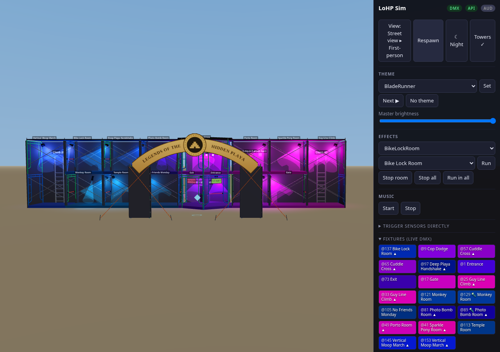
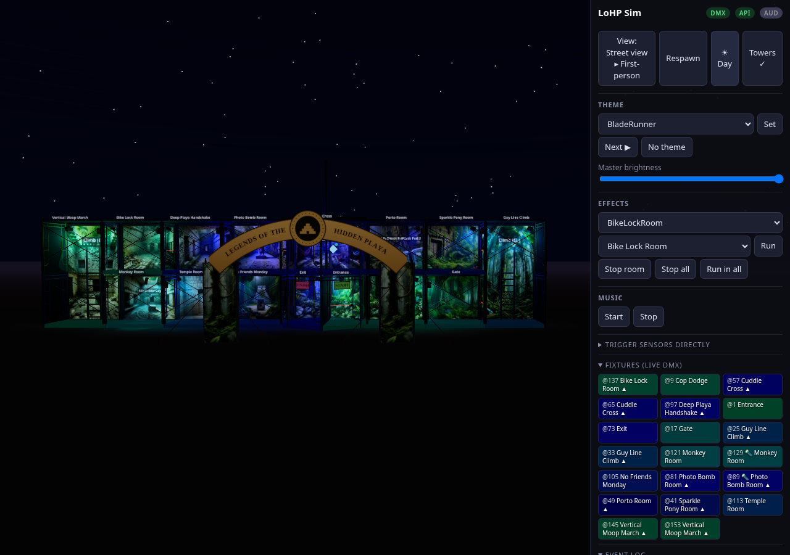

# LoHP Maze Simulator

Full virtual emulation of the maze for development and testing without hardware:
the **real, unmodified server** runs against a virtual DMX universe, a browser-based
3D sim renders the lights and fires the sensors, and (optionally) real ESPHome node
firmware runs natively as the sensor layer.

Everything lives in this folder — **zero changes to production code**. The launcher
injects `virtual_dmx.py` in place of `dmx_interface` (the FTDI driver, the server's
only hardware dependency) and then executes `main.py` verbatim.

| Street view — day | Street view — night |
|---|---|
|  |  |

*(both with the decorative entrance towers + arch sign shown — the Towers button
hides them; day/night toggles with N)*

## The structure (matches the real build)

The maze is a **two-story, open-faced scaffold structure** on playa (Burning Man):
every room's street face is open, so the whole piece reads like a dollhouse from
the street — the sim's street view (screenshots above) **is** the elevation. **Real hardware**: ScaffoldExpress **5' × 6'4" × 7' S-Style walk-thru frame
sets** (PSV-K610-7: two PSV-610 frames + two PSV-303 7'×4' tube cross braces,
9" coupling pins with 1" collars, toggle pins and spring clips; 1.6925"Ø ×
0.095"-wall Q235 tube) — so each room bay is **7 ft wide × 5 ft deep × 6'4" tall**
(2.13 × 1.52 × 1.93 m), adjacent rooms **share one frame** (bays abut, no gaps),
and the braces pin to leg studs **8.5" down from the frame top with a 4 ft
spread** — wide flat scissors crossing just above mid-height, not corner-to-corner
X's — on both the front and back planes. The whole run — seven 7ft wing bays plus
the 10ft hexagon — is ≈ 59 ft long, ~12.7 ft tall.

Ground floor: Entrance, Cop Dodge, Gate, Monkey, Temple, No Friends Monday, Exit.
Upper floor (+6'4"): Sparkle Pony, Porto, Cuddle Cross, Photo Bomb, Deep Playa
Handshake, Bike Lock. Full-height climb rooms connect the floors: visitors climb
**up in Guy Line Climb** (east end) and **down in Vertical Moop March** (west end).
At those two far ends the skin hangs on the **outside** of the end frames — inside
the shaft stays bare scaffold, so the frames' ladder rungs are the climb.

**The center is a hexagon of twelve complete 5' walk-thru frames** — six per
level, one per side, real pieces only, **hose-clamped in pairs at every
corner, with no cross braces**. A **corner points at the street**: the two
angled street frames meeting at it are the split **entry (START sign, east)**
and **exit (FINISH sign, west)** — each frame's walk-thru arch is one door.
The side rooms walk into the center through the flat east/west frames'
arches, the two back frames are skinned. The ground floor is split Exit
(west) / Entrance (east) by a divider running front corner to back corner;
the upper deck is Cuddle Cross. The single **RPi + USB-DMX** box mounts
**outside on the back wall**, behind Cuddle Cross on the shared scaffold
frame with Photo Bomb Room (the PoE switch and extra Pis are gone).

**Out front on the street stand two decorative entrance towers** (see
`hiddenplaya.art/maze-1.jpeg`) with the *Legends of the Hidden Playa* sign
arching between them, medallion at the peak. Each tower is three **3' × 4'
ladder frames** from the same tube-and-pin fleet, hose-clamped into a triangle
in plan (flat face to the street, apex toward the maze), stacked two tiers
tall (8 ft), skinned on the outside and guyed to playa stakes with orange
ratchet straps. **Purely decorative — no fixtures, no sensors, no lights at
this time** (`entrance_towers` in `maze_layout.json`).

The structure has a **roof** over the top floor (hidden automatically in the
overhead plan view), and **all lights and sensors mount on the back scaffolding/
cross members**: fixtures are bracket-mounted, tilted down into their rooms (no
poles in the walkways, nothing hangs mid-room); tripwire emitters sit on the
frames at beam height.

**Room backdrops**: every room's back wall carries its real printed-canvas
background (the print masters live in `Background-images/` at the repo root,
untracked — the sim serves resized copies from `web/img/backgrounds/`, mapped
via `background` keys in `maze_layout.json`). The twelve wing rooms get one
canvas each (full two-story prints in the climb shafts); the hex center gets
one **wide canvas per level spanning both skinned back faces** — ground backs
the Exit|Entrance halves, upper backs Cuddle Cross — and the `Towers` print
wraps each entrance tower's three outside faces (middle third to the street,
seam at the back apex). Backdrops use lit materials, so the DMX fixtures
genuinely illuminate them and each room's canvas glows with its effect color;
at night they keep a faint emissive floor so the art stays readable.

The frames are modeled to the real PSV-610 geometry (taken off the product
photo): legs with 9" coupling pins under 1" collars, a top rail over a
full-width header tied by three short stubs, doorway tubes hanging from the
header that candy-cane out into the legs ~12" up, two ladder rungs per side,
and brace studs on each leg (8.5" down from the top, 4' apart) — **painted blue
and green** like ours (alternating, since the fleet is a repainted mix), with
galvanized pins, braces, clamps, and ladders. Cuddle-pit note: its pars and the four-button
station mount on the hexagon's back faces upstairs, not the doorway frames.

**Source of truth for lighting**: `sim/maze_layout.json` (`fixture_positions`),
originally transcribed from the old `maze-diagram.drawio` (since deleted — it was
pre-wireless / pre-single-Pi, but accurate for fixture locations and DMX cable
routing). From its icons: bulbs = the circular pars; **flashlights = the two
U'King DMX spotlights** (Monkey Room, Photo Bomb Room), which the sim renders as
narrow-beam spots. The cable chain runs in exact DMX address order (east wing
out, Cuddle Cross east→west, to the box on the back at the Cuddle Cross / Photo
Bomb frame, west wing out).

Canonical visitor route: Entrance → Cop Dodge → Gate → *up* Guy Line Climb →
Sparkle Pony → Porto → Cuddle Cross → Photo Bomb → Deep Playa Handshake → Bike Lock
→ *down* Vertical Moop March → Monkey → Temple → No Friends Monday → Exit.

**Getting upstairs in first-person**: walk into Guy Line Climb (or Vertical Moop
March) — a "Press E to climb" prompt appears near the ladder; press **E** (no need
to aim at it). Same to come back down. In street/overhead views you can also click
a ladder, or click any upper-floor deck to teleport up.

## Quick start

```bash
sim/run.sh -d        # background; logs to sim/sim.log — or omit -d for foreground
```

| Port | What |
|---|---|
| **5001** | 3D sim UI (this folder) — open in any browser on the LAN |
| 5000 | real server REST API + stock control panel (unchanged) |
| 8765 | real server unit-audio WebSocket (unchanged) |

Stop with `sim/stop.sh`. First run creates `sim/.venv` automatically.

**Views** (M cycles): **Street** (default — the whole facade at once, drag to pan,
wheel to dolly, the way the piece reads on playa) · **First-person** (WASD + mouse-
look, E to use buttons/pads/ladders, walk through red doorway beams to trip sensors)
· **Overhead plan** (Ground/Upper/Both floor filter, click floor to teleport).
**Day / night** (N or the ☀/☾ button, remembered across reloads): night is the
default show environment; day mode brings up playa daylight — handy for checking
the unlit structure itself, like the entrance towers. The **Towers button**
shows/hides the decorative entrance towers + arch sign (also remembered), since
they stand in front of part of the facade in street view.

## Editing workflow — what's real vs. sim-only

We iterate here, then the same files drive physical equipment. Everything the sim
shows comes from **production configs and code**, with one sim-only exception:

| You want to change | Edit | Real or sim-only? |
|---|---|---|
| Effect timing/colors per room | `../effects/*.py` (+ register in `../effects_manager.py`) | **REAL** — this is the production effect engine |
| Ambient themes | `../theme_manager.py` | **REAL** |
| Which sound an effect plays, volumes | `../audio_config.json` | **REAL** |
| Sound/music files | `../audio_files/`, `../music/` | **REAL** |
| Which effect a sensor/room triggers | `../client/config-unit-*.json` (today's Pis) and `esphome/rooms/*.yaml` (ESP32 nodes) | **REAL** — sim reads the unit configs live |
| Fixtures: rooms, models, DMX addresses | `../light_config.json` | **REAL** |
| Buttons (what the 4 arcade buttons do) | `../client/config-unit-a.json` | **REAL** |
| 3D geometry: room bays, floor levels, beam/button/pad positions, route, spawn, playa environment | `maze_layout.json` (+ `web/app.js` for looks) | **sim-only** (visualization) |

Restart needed after editing Python (`sim/stop.sh && sim/run.sh -d`); JSON config
changes only need a browser refresh (`/sim/config` re-reads them per request).
So: design an effect in the sim → it's already production code → deploy to the
physical server → identical behavior on real fixtures (once addressing is fixed,
below).

## Rooms without designed lighting/audio yet (updated 2026-07-17)

Four rooms have **no doorway trigger wired**: **Temple Room, Monkey Room,
Vertical Moop March, Exit**. They used to fire a generic Lightning placeholder on
entry, but that was test wiring and was removed — Lightning itself stays
registered (the hex "Storm All Rooms" button and the API still use it). Their
sensor geometry remains in `maze_layout.json` for when bespoke doorway effects
get designed (the old aspirational names were MoopMarch/TempleAmbience;
MonkeyBusiness now exists but is the puzzle *button* effect, deliberately not
the doorway). Other design gaps found:

- **Bespoke effects that exist but nothing triggers**: GateGreeters, GuyLineClimb
  (the Guy Line sensor fires ImageEnhancement instead — intentional?), PortoHit,
  PhotoBomb-BG, DeepPlaya-BG, LightningStorm.
- **Effects with no audio mapped**: GuyLineClimb, PortoHit, PhotoBomb-BG.

## ⚠ HARDWARE DAY: re-address the physical fixtures (config already fixed)

The old `light_config.json` daisy-chained DMX addresses by true channel count
(…89, 95, 103…), but the server code assumes uniform 8-channel slots
(`(start-1)//8`) — every fixture from 95 on was misaligned and the sim rendered
the west wing dark/garbled, exactly as hardware would. **On 2026-07-17 the config
was fixed to clean 8-aligned addresses so the whole maze works in the sim and the
config is now the build spec.** The physical fixtures must be set to these
addresses when rigging:

```
unchanged: 1, 9, 17, 25, 33, 41, 49, 57, 65, 73, 81, 89
re-set:    95→97   103→105   111→113   119→121  (Deep Playa, NFM, Temple, Monkey par)
           127→129 133→137   141→145   149→153  (Monkey spot, Bike Lock, Moop March ×2)
```

Also fixed: the U'King spotlight channel *keys* in `light_config.json` were renamed
to the effect-engine vocabulary (`total_dimming`, `r_dimming`, …) so themes and
effects actually drive the two spots. The wire format is untouched (ch0=dimmer,
1=R, 2=G, 3=B, 4=W) and `color_macro` keeps its own name so nothing ever writes
the fixture's built-in color-program channel.

## "Sensors firing at idle?"

They aren't — the server is **shared**. Every connected browser tab, test script
(`tools/`), ESPHome node, and curl fires the same real API, and lights/audio react
everywhere; your tab's event log only records **your own** actions. Verified from
the access log (2026-07-16): every trigger attributes to a real source (your
browser's clicks/walks, the scripted walkthrough, the ESPHome bench node). The
scripted tools announce themselves in this README — run them yourself with the page
open and you'll see the "ghost" activity they produce.

## What is emulated, and how faithfully

| Layer | How | Fidelity |
|---|---|---|
| DMX output | `virtual_dmx.py` replaces the FTDI thread; same 44Hz loop over `DMXStateManager` | Same frames that would hit the wire |
| Fixtures | Each 3D fixture decodes the **raw universe at its configured start address** using the channel map from `light_config.json` | Reproduces addressing bugs |
| Sensors | Beam/button/pad geometry in `maze_layout.json` (floor-aware), actions verbatim from `client/config-unit-*.json`; piezo 3-attempt/25% logic mirrors `trigger_manager.py`; 5s cooldowns | Same HTTP POSTs as the Pis / planned ESP32s |
| Audio | The page connects to `:8765` speaking the unit protocol, claims all 15 rooms, plays served MP3s via Web Audio, spatialized at room+floor positions | Same messages a Pi unit receives |
| ESP32 nodes | Real ESPHome YAML compiled for the `host` platform → native Linux processes that fire real `http_request` POSTs (`esphome/`, verified end-to-end) | Real firmware engine, virtual sensor input |

Extra: set `SIM_ARTNET=<ip>` before launch to also unicast the universe as Art-Net —
point BlenderDMX (or QLC+, Capture, …) at it. Don't run an Art-Net *listener* on
this same machine (UDP 6454 clash).

## Test tools (they light up the maze for everyone connected!)

```bash
sim/.venv/bin/python sim/tools/smoke_test.py     # headless end-to-end: frames, trigger→DMX, theme, audio protocol
sim/.venv/bin/python sim/tools/walkthrough.py    # scripted visitor walks the full two-story route; all triggers must 200
sim/.venv/bin/python sim/tools/concurrency_test.py  # simultaneous-trigger storms, stop/supersede semantics
sim/.venv/bin/python sim/tools/photobooth_test.py   # Photo Bomb countdown/flash/photo + Monkey fanfare timelines
```

Note: the server holds `/api/run_effect` open until the effect finishes (up to ~20s);
test tooling fires triggers concurrently rather than waiting serially.

## Photo booth & monkey buttons

Two clickable buttons exist in the 3D world (and in the Triggers panel): **"Say
Cheese!"** in Photo Bomb (upstairs) starts the 3-2-1 countdown → white FLASH →
the server's `camera_manager.py` stores a photo (synthetic SMPTE-bars JPEG when
no webcam is attached — check `GET :5000/api/photobomb/photos`); **"Silver
Monkey"** in Monkey Room fires the sampled Shrine of the Silver Monkey fanfare
with synced gold flashes. Same POSTs the room ESP32 buttons send.

## Known limits

- No collision — you can walk through walls; floors change only via ladders (E) or
  teleporting. Sensors fire only on their beams (level-aware) and clicks.
- One browser tab should own audio: the server routes each room to the first client
  that claimed it (same rule as the real units).
- `function_selection`/`function_speed` channels aren't visualized; strobe is approximated.
- Headless/software-GL browsers run slowly; use a real GPU browser.
